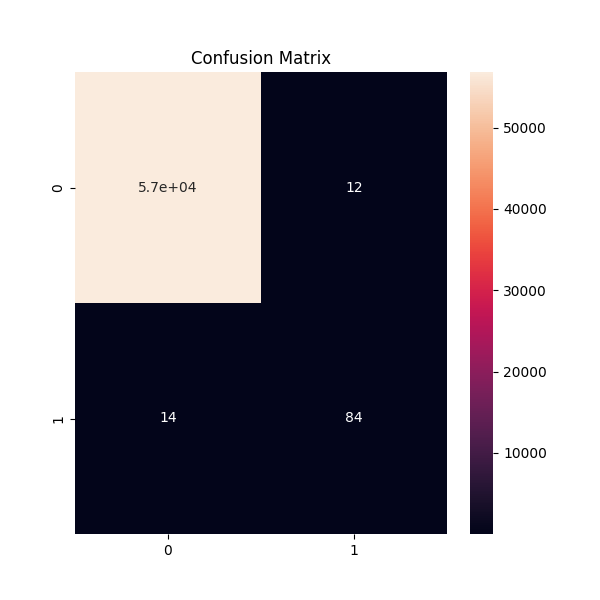
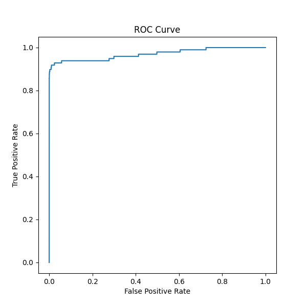
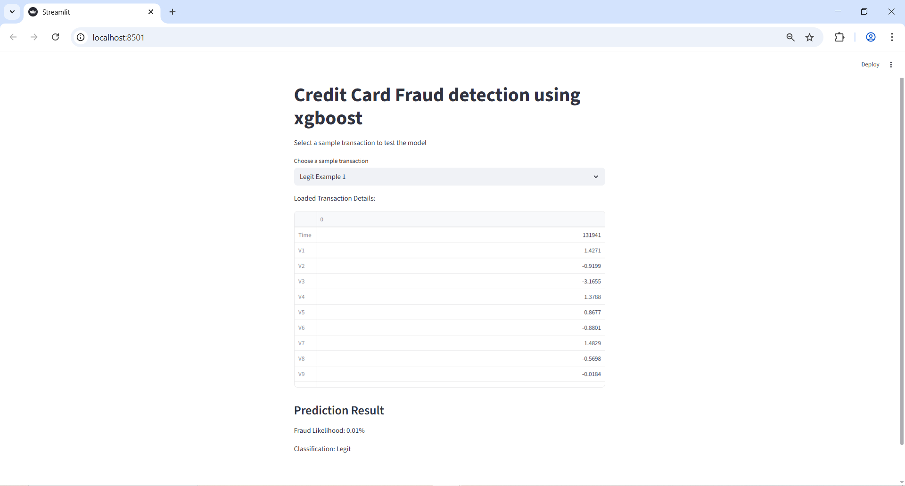
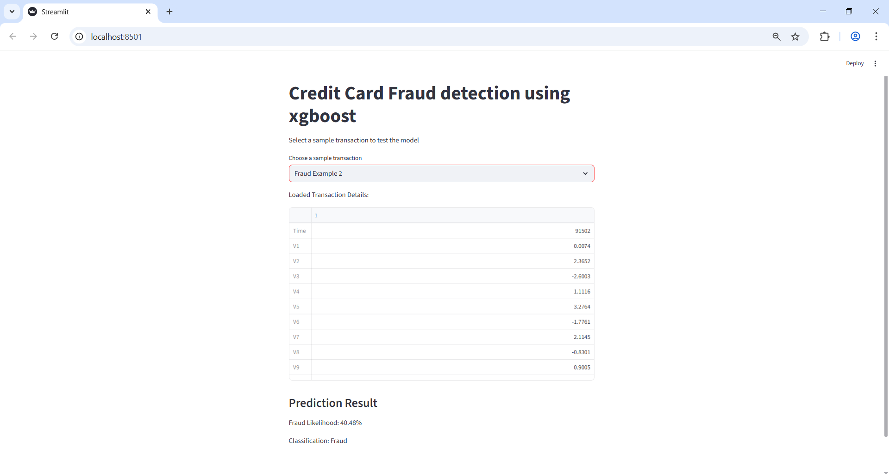

Credit Card Fraud Detection Project

## 1. Project Overview

Objective: Build a machine learning model to classify transactions as fraudulent or legitimate.

Problem Type: Binary classification with highly imbalanced data.

Current Deliverable: Fraud detection model built with XGBoost, deployed via a Streamlit app.

Deployment Goal: Interactive app where users can load sample transactions and see fraud probability.

## 2. Dataset

Source: Kaggle – Credit Card Fraud Detection

Features:

- PCA-transformed variables (V1–V28)
- Transaction Amount
- Time (seconds elapsed since first transaction)
  Target: Class → 0 (Legit), 1 (Fraud)

## 3. Data Preprocessing

- Train-test split (80/20)
- Scaled Amount and Time using StandardScaler
- Addressed imbalance using class weights in XGBoost

## 4. Model Building

Model: XGBClassifier
Parameters: objective='binary:logistic'
eval_metric='logloss'
scale_pos_weight=<calculated value>
Saved trained model and scaler using joblib

## 5. Model Evaluation

Predictions: Used class labels for classification metrics and fraud probabilities for ROC-AUC evaluation and ROC curve plotting.

Metrics:

- Classification report (precision, recall, F1 score)
- Confusion matrix(visualized with heatmap)
- ROC AUC score
- ROC curve plot

Note: All evaluation visuals are available in the Jupyter Notebook. The Streamlit app focuses on interactive prediction for usability.

## 6. Streamlit App

Inputs:

- Dropdown to load sample transactions (Legit or Fraud example)

Outputs:

- Fraud probability (e.g., “Fraud likelihood: 87%”)
- Classification result (Fraud / Legit)

## 7. Deployment

Run locally with:
streamlit run app.py
Ensure reproducibility with requirements.txt
Use a virtual environment for clean setup

## 8. Repository Structure

/models -> saved model + scaler
/data -> dataset downloaded and samples for testing
/notebooks -> EDA + training
app.py -> Streamlit app
requirements.txt
README.md -> project overview

## 9. Future Enhancements (planned but not yet implemented):

- Train a basic feedforward neural network (MLP) on the PCA-transformed features.
- Compare its performance with XGBoost to evaluate which handles class imbalance more effectively.
- Experiment with autoencoders for unsupervised anomaly detection.
- Explore LSTMs if transactions are treated as sequences over time.

Note: These enhancements are lightweight and feasible.The dataset size is manageable, so experiments with MLPs, autoencoders, and even LSTMs can be run locally using CPU .

## 10. Screenshots

Model Evaluation:

Confusion Matrix:

ROC Curve:

Streamlit App Demo:

Legitimate Transaction Example

Fraudulent Transaction Example

Note:The app uses a tuned threshold of 0.4 to detect more fraud cases. Legitimate transactions are still identified correctly, and more frauds are detected compared to the default 0.5 setting.

## 11. Acknowledgments

Dataset provided by Kaggle
Libraries: Python, NumPy, Pandas, Scikit-learn, XGBoost, Streamlit, Seaborn, Matplotlib
